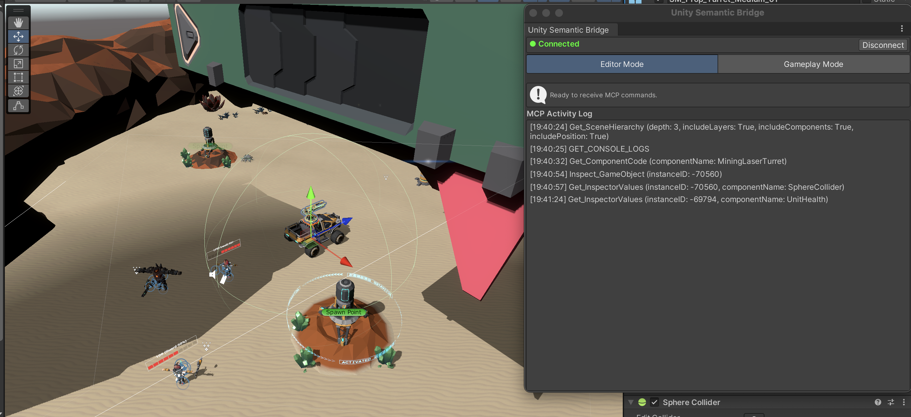

# Unity Semantic Bridge (USB)


A Unity MCP Bridge built for agents working alongside you in a live Editor session — not just querying a static project. Token-efficient tools give your agent visibility into what changed in the scene while you were both working in it.



## Features

- Optimized scene heirarchy query and gameobject inspection tools with workflow hints for agents - more token efficient than official Unity CLI tool
- In Editor connection status and auto reconnect through domain reloads. 
- Not tied to Unity Licensing - Runs 100% local. No need to reauthenticate when token expires
- Dedicated tools for agent to see human actions and changes
- Dedicated tools for working with Scriptable objects (error prone if agent uses bash to work SOs directly)
- In Editor MCP log so you can see what tools are called
- Dedicated Lighting tools for URP projects

## Prerequesites

 - **Unity 2022.3 LTS up to Unity 6.3** 
	- uses `UnityEditor.ObjectChangeEvents.changesPublished` available in 2022.3 LTS and later
	- versions of Unity 6.5+ swap `InstanceIds` for `EntityIds` - current ID protocol still uses `int` instance IDs and `GetInstanceID()`, which is fine up to 6000.3 but deprecated in Unity 6.5. A full `EntityId` migration (protocol + Selection.entityIds throughout) is planned for supporting newer versions.
- **uv** (https://docs.astral.sh/uv/getting-started/installation/)

####  Optional
- **API key for LLM with strong vision capabiltiies** - lighting subagent can be powered by a separate LLM (ideally with vision-in-the-loop like Astra or Kimi K3); see `/core/llm_provider.py`. Tools are still available to your main/orchestrator agent even without setting up the subagent. Previously used mcp sampling but this was deprecated. 

## Installation

1. Clone this project.
2. Add the Unity package in `/com.gamenami.unity-semantic-bridge` to your Unity project via "add package from disk".
3. Install `uv`, then register the **Python MCP server** in `/mcp-editor-bridge` with your agent using one of the configurations below. The agent launches Python over **stdio**; Python POSTs JSON-RPC to Unity at `http://127.0.0.1:1073/rpc`. The Unity `/rpc` URL is the Python server's downstream connection; it cannot be used directly as an MCP server URL.
4. In Unity, open **Tools > Unity Semantic Bridge**, then start the HTTP listener (port 1073). Health check: `GET http://127.0.0.1:1073/health`.

### Codex CLI

Run this in your shell, replacing the example path with your clone's absolute path:

```sh
codex mcp add unity-semantic-bridge -- uv --directory "/absolute/path/to/unity-semantic-bridge/mcp-editor-bridge" run main.py
```

Alternatively, add this TOML entry to `~/.codex/config.toml`:

```toml
[mcp_servers.unity-semantic-bridge]
command = "uv"
args = [
    "--directory",
    "/absolute/path/to/unity-semantic-bridge/mcp-editor-bridge",
    "run",
    "main.py",
]
```

Each array entry is **one command-line argument**. Do not combine arguments into
strings such as `'"run", "main.py"'`: that passes the quotes and comma literally
as one argument. In a UI with separate argument fields, enter one value per
field without JSON punctuation.

Check the saved configuration with `codex mcp get unity-semantic-bridge`.
After changing the configuration or Python tool definitions, exit the running
CLI with **Ctrl+D**, run `codex resume` from the same project directory, and
select your conversation. Use `/mcp` to check connection/tool discovery.
If it reports **failed (0 tools)**, check the Python startup command and error;
restarting Unity's listener cannot fix malformed Python launch arguments.

### Clients using JSON configuration

Merge this entry into your client's MCP configuration, replacing the path:

```json
{
    "mcpServers": {
        "unity-semantic-bridge": {
            "command": "uv",
            "args": [
                "--directory",
                "/absolute/path/to/unity-semantic-bridge/mcp-editor-bridge",
                "run",
                "main.py"
            ]
        }
    }
}
```

## Available Tools

**Human-Agent Cowork**
- `get_recent_unity_events` — Returns Unity Editor events (`hierarchy`/`selection`/`play-mode`/`console`/`objectChanged` via `ObjectChangeEvents.changesPublished`) pushed since a time window — use to see human edits, `add_component`/`remove_component`/`set_field_values` etc.
- `notify_unity` — Sends a message to the Unity Editor chat window (`BridgeRelay.OnAgentMessage`).

**Project & Settings**
- `get_project_settings` — Returns Unity Project Settings as JSON. Selectively fetch `core` (Unity version, build target), `rendering` (URP asset, color space, MSAA), `input` (Input Handling, `inputactions` assets), `ui` (uGUI vs UI Toolkit counts), `scripting` (API level, define symbols, backend), `tags_layers`.

**Scene & GameObject Inspection**
- `get_scene_hierarchy` — Returns the scene as a list of GameObjects with paths and instance IDs. Usually the first tool to call. Supports depth limiting, a node cap with truncation reporting (for large scenes), optional filtering to only main-camera-visible objects, and `root_instance_id` subtree queries.
- `get_gameobject_tree` — Full hierarchy under a specific GameObject (faster than `get_scene_hierarchy` for rigs; avoids `SkinnedMeshRenderer` pruning).
- `inspect_gameobject` — Detailed inspection of a GameObject including components and public fields (uses `ComponentInspector` with expanded `Generic` structs).
- `get_component_inspector_values` — All serialized field values visible in the Inspector for a specific component (live Editor values, expands `RigBuilder`/`Rig`/`*Constraint.m_Data`/`Transform.m_LocalRotation` as structured `quat`+`euler`).
- `get_component_code` — Locates and returns the full C# source for a named component (`MonoScript` via `AssetDatabase`).
- `get_physics_layers` — Physics layer collision matrix (`Physics.GetIgnoreLayerCollision`).

**Scene & GameObject Authoring (Hierarchy & Rigging)**
- `create_gameobject` — Creates a new `GameObject` (`new GameObject(name)`) with `Undo.RegisterCreatedObjectUndo`, optional `parentInstanceId` via `SetParent(parent,false)`, and optional `localPosition`/`localRotation` (`{x,y,z,w}` or `{euler}`) / `localScale`. Returns `{instanceId,path}`.
- `duplicate_gameobject` — Duplicates a hierarchy via `Instantiate` + `Undo.RegisterCreatedObjectUndo` (use for cloning whole rig layers, e.g. `Rig Layer (Rifle Idle)`). Returns `{instanceId,path}`.
- `set_parent` — Reparents via `Undo.SetTransformParent` (or `RegisterCompleteObjectUndo`+`SetParent` when `keepWorldPosition:true`). Pass `null` to unparent to root.
- `delete_gameobject` — Deletes a `GameObject` via `Undo.DestroyObjectImmediate` (supports Undo).
- `copy_component` — Deep-copies a component via `Undo.AddComponent` + `EditorUtility.CopySerialized` (required for Animation Rigging `Constraint.data` structs where `m_Data: [Generic]` cannot be rebuilt via `set_field_values`). Returns `{targetComponentIndex,targetInstanceId}`.
- `add_component` — Adds a component by `instance_id` (`Type.GetType` + assembly fallback, respects `allowDuplicate`).
- `remove_component` — Removes a component by `instance_id` (`Undo.DestroyObjectImmediate`).
- `set_field_values` — Sets one or more serialized field values via `SerializedObject`/`FindProperty` + `Undo.RecordObject` (supports primitives, enums as strings, `Vector2/3`, `Quaternion`, `Color`, `ObjectReference` as `instanceId`, `Generic`/`Array` for `RigBuilder`/`Constraint` data).

**Assets & ScriptableObjects**
- `find_unity_files` — Finds assets in Unity via `AssetDatabase.FindAssets` (`t:Prefab`, `l:Label`, etc.), default `folders:['Assets']`.
- `find_asset_references` — Finds assets/scenes referencing a specific asset path (`AssetDatabase.GetDependencies`).
- `get_project_tree` — Project folder structure from a path (`AssetDatabase.GetSubFolders` + direct-file filter).
- `write_unity_script` — Creates/overwrites a C# script (`Assets/...cs`) and triggers recompilation (`AssetDatabase.ImportAsset`/`Refresh`, `CONFIRM_REQUIRED` pattern).
- `create_scriptable_object` — Creates a `ScriptableObject` asset atomically without `write_unity_script`: `Type.GetType` + assembly fallback, `ScriptableObject.CreateInstance`, field init via `SerializedObject` (primitives, enums as `"cross"`→`UnitId.cross`, `Vector3` `{x,y,z}`, `Object` refs as `instanceId`/`guid`/`{fileID,guid}`), `Undo.RegisterCreatedObjectUndo` + `AssetDatabase.CreateAsset/SaveAssets/Refresh`. Validates `Assets/` + `.asset`, parent folder exists, `ScriptableObject` subclass, `CONFIRM_REQUIRED` on overwrite. Returns `{instanceId,guid,path}`.
- `delete_asset` — Deletes an asset via `AssetDatabase.DeleteAsset` (supports Undo, validates `Assets/`).
- `refresh_assets` — No-argument asset refresh after external disk edits; Unity decides whether compilation/reload is needed. See [refresh workflow](mcp-editor-bridge/README.md#refreshing-external-file-edits).
- `get_compilation_status` — Non-blocking snapshot (`PENDING`/`SUCCESS`/`FAILED`/`NO_COMPILATION`/`UNKNOWN`) — poll after `write_unity_script` or `refresh_assets`.

**Editor & Runtime**
- `get_screenshot` — Captures `game` (`Camera.main`) or `scene` (Scene view) as JPEG; `scene` can `Frame` a `focus_instance_id` bounds before capture.
- `set_play_mode` — Enters/exits Play Mode (`EditorApplication.isPlaying` via `delayCall`).
- `get_console_logs` / `clear_console_logs` — Read last 10 errors/warnings via `LogEntries` reflection or clear (`LogEntries.Clear`).

**Lighting Diagnostics**
- `get_lights_affecting_object` — Lights within range of a target object using actual bounds distance, per-light `type`/`intensity`/`range`/`cullingMask` (uses `GetLightsAffectingObject`).
- `get_urp_pipeline_settings` — URP asset’s current render path setting (`GetUrpPipelineSettings`).
- `diagnose_lighting_issue` — Autonomous diagnostic subagent (lights → URP → renderer/materials) via `core.llm_provider`; see `LightingAgent/README.md`. Requires `LIGHTING_LLM_PROVIDER`/`MODEL` + API key.


## Known Limitations (for Agents using this tool to read)

- **Unity instance IDs are not stable across script recompiles or domain reloads.** Any C# change invalidates previously-fetched instance IDs — re-run `get_scene_hierarchy` after recompiling before reusing an ID from an earlier call.
- **The Editor connection is single-flight.** Only one MCP request is processed at a time; overlapping calls queue rather than run concurrently, since Unity's Editor-side message handling is inherently serial.
